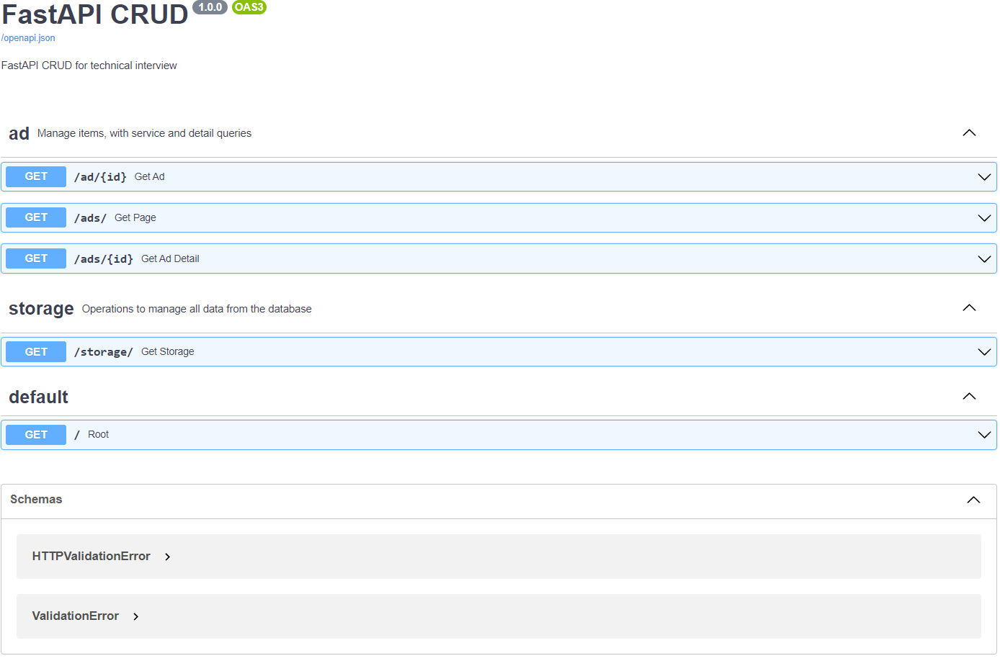

<div id="top"></div>

<br />
<div align="center">

  <h1 align="center">Technical Interview Project</h1>

  <p align="center">
    Marketplace created with FastAPI and CSV as database
    <br />
    <a href="https://github.com/othneildrew/Best-README-Template"><strong>Explore the docs »</strong></a>
    <!--<br />
    <br />
    <a href="https://github.com/othneildrew/Best-README-Template">View Demo</a>
    ·
    <a href="https://github.com/othneildrew/Best-README-Template/issues">Report Bug</a>
    ·
    <a href="https://github.com/othneildrew/Best-README-Template/issues">Request Feature</a>-->
  </p>
  <h3 align="left">Connect with me:</h3>
    <p align="left">
    <a href="https://www.linkedin.com/in/iakigarcia" target="blank"></a>
    <a href="https://es.stackoverflow.com/users/158274/iakigarci" target="blank"></a>
    </p>
</div>


<!-- TABLE OF CONTENTS -->
<details>
  <summary>Table of Contents</summary>
  <ol>
    <li>
      <a href="#about-the-project">About The Project</a>
      <ul>
        <li><a href="#built-with">Built With</a></li>
      </ul>
    </li>
    <li>
      <a href="#getting-started">Getting Started</a>
      <ul>
        <li><a href="#prerequisites">Prerequisites</a></li>
        <li><a href="#installation">Installation</a></li>
      </ul>
    </li>
    <li><a href="#usage">Usage</a></li>
    <li><a href="#contributing">Contributing</a></li>
    <li><a href="#license">License</a></li>
    <li><a href="#contact">Contact</a></li>
  </ol>
</details>


<!-- ABOUT THE PROJECT -->
## About The Project
As a marketplace we need to have an effective search engine to be able to offer our products.

Our ads are classified according to their material and composition (metals, plastics, ...).

In this test we want you to implement a textual search engine that allows us to search both in the materials and in the name of the ad, as long as it is available.

## Tasks

The main task is to implement the service for search and the ad detail.

The search will have as parameters the term entered by the user and the pagination (records per page and page number).

You can use REST, GraphQL, GRPC at your choice.

The quality of the code will be a major consideration in the exercise.

### Data Structure

File ad.csv:

- id : UUID
- name: String
- amount: Integer
- price: Integer (Note: the price is multiplied by 100 to avoid decimals. ej : 150 -> 1,5 )
- material: String

*SEARCH SERVICE*

Parms:

- term : Search term , String
- perPage: Elements per page , Integer
- nPage: Page to show, Integer

Response body:

```
{
    "ads":[
        {
            "id":"uuid-ad",
            "name":"Test Ad",
            "amount":15,
            "price": 7,85
        },...
    ],
    "total":"n-total-ad",
    "current": "current-page",
    "nextPage": "next-page"
}
```

*DETAIL SERVICE*

Parms:

- id: add-uid

Response Body

```
{
    "id":"uuid-ad",
    "name":"Test Ad",
    "amount":15,
    "price": 7,85
    "relatedAds":[{adModel...}] (same material)
}
```

### Bonus Tasks

As you have probably observed the data is a bit denormalised, as an bonus task we propose you to normalise the data in an Entity-Relationship model and implement the services with it. You can use any database you want for this purpose.


<p align="right">(<a href="#top">back to top</a>)</p>


## Built With

The technologies used for this project are as follows:
<p align="left">
<!-- https://devicon.dev/ -->
  
<!-- AWS -->
<!-- BASH -->     
<!-- DOCKER -->
<!-- KUBERNETS  -->
<!-- JAVA -->
<!-- JS -->
<!-- Node -->
<!-- EX -->
<!-- TS -->
<!-- React -->
<!-- Mongo -->


<!--  -->
<!--  -->
<!--  -->
<!--  -->
</p>      

<p align="right">(<a href="#top">back to top</a>)</p>


<!-- GETTING STARTED -->
## Getting Started


### Prerequisites

Check if you have Python installed. For this project, Python version 3.7 has been used.
* python
  ```py
  python --version // Windows
  python3 --version // UNIX
  ```

### Installation


1. Clone the repository
   ```sh
   git clone https://github.com/iakigarci/TechnicalInterview1.git
   ```
2. Create Python virtual environmet
   ```py
   python vevn .venv // Windows
   python3 venv .venv // Unix
   ```
3. Activate the virtual environment
   ```sh
   source .venv/Scripts/activate
   ```
4. Install project dependencies from `requirements.txt` file
   ```py
   pip install -r requirements.txt
   ```

<p align="right">(<a href="#top">back to top</a>)</p>


<!-- USAGE EXAMPLES -->
## Usage

Follow these steps after performing the installation steps:

1. Start the server with _uvicorn_
   ```sh
   cd src
   uvicorn main:app --reload
   ```
2. Go to [localhost:8000/docs](localhost:8000/docs) or [127.0.0.1:8000/docs](127.0.0.1:8000/docs)


<p align="right">(<a href="#top">back to top</a>)</p>


<!-- ROADMAP -->
<!--## Roadmap

- [x] Add Changelog
- [x] Add back to top links
- [ ] Add Additional Templates w/ Examples
- [ ] Add "components" document to easily copy & paste sections of the readme
- [ ] Multi-language Support
    - [ ] Chinese
    - [ ] Spanish

See the [open issues](https://github.com/othneildrew/Best-README-Template/issues) for a full list of proposed features (and known issues).

<p align="right">(<a href="#top">back to top</a>)</p>-->


<!-- CONTRIBUTING -->
## Contributing

Contributions are what make the open source community such an amazing place to learn, inspire, and create. Any contributions you make are **greatly appreciated**.

If you have a suggestion that would make this better, please fork the repo and create a pull request. You can also simply open an issue with the tag "enhancement".
Don't forget to give the project a star! Thanks again!

1. Fork the Project
2. Create your Feature Branch (`git checkout -b feature/AmazingFeature`)
3. Commit your Changes (`git commit -m 'Add some AmazingFeature'`)
4. Push to the Branch (`git push origin feature/AmazingFeature`)
5. Open a Pull Request

<p align="right">(<a href="#top">back to top</a>)</p>


<!-- LICENSE -->
## License

Distributed under the MIT License. See `LICENSE.txt` for more information.

<p align="right">(<a href="#top">back to top</a>)</p>


<!-- CONTACT -->
## Contact

Iñaki García : inaki.garcianoya@gmail.com

Project Link: [https://github.com/iakigarci/TechnicalInterview1](https://github.com/iakigarci/TechnicalInterview1)

<p align="right">(<a href="#top">back to top</a>)</p>


<!-- CONTRIBUTORS -->
<!--
## Contributors
* iakigarci [https://github.com/iakigarci/](https://github.com/iakigarci/)

-->

<!-- MARKDOWN LINKS & IMAGES -->
<!-- https://www.markdownguide.org/basic-syntax/#reference-style-links -->
[contributors-shield]: https://img.shields.io/github/contributors/othneildrew/Best-README-Template.svg?style=for-the-badge
[contributors-url]: https://github.com/othneildrew/Best-README-Template/graphs/contributors
[forks-shield]: https://img.shields.io/github/forks/othneildrew/Best-README-Template.svg?style=for-the-badge
[forks-url]: https://github.com/othneildrew/Best-README-Template/network/members
[stars-shield]: https://img.shields.io/github/stars/othneildrew/Best-README-Template.svg?style=for-the-badge
[stars-url]: https://github.com/othneildrew/Best-README-Template/stargazers
[issues-shield]: https://img.shields.io/github/issues/othneildrew/Best-README-Template.svg?style=for-the-badge
[issues-url]: https://github.com/othneildrew/Best-README-Template/issues
[license-shield]: https://img.shields.io/github/license/othneildrew/Best-README-Template.svg?style=for-the-badge
[license-url]: https://github.com/othneildrew/Best-README-Template/blob/master/LICENSE.txt
[linkedin-shield]: https://img.shields.io/badge/-LinkedIn-black.svg?style=for-the-badge&logo=linkedin&colorB=555
[linkedin-url]: https://linkedin.com/in/othneildrew
[product-screenshot]: images/screenshot.png
